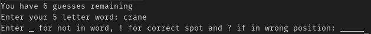
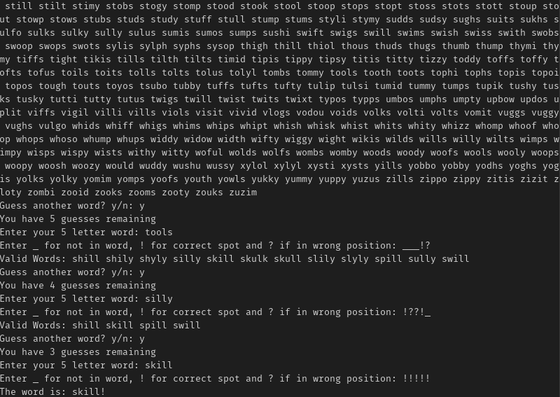

# Wordle Helper

This is a simple python program that helps eliminate words based on your guess.

Example:

- The user enters a word
	- The user then has to validate all the word using the following:
		- `_` for invalid letter.
		- `!` for a correct letter in the correct place.
		- `?` for a correct letter in the wrong place.
	- The program then eliminates words that don't fit this criteria.
- The program will then list all possible words that fit the current criteria

...

**NOTE:** The list was borrowed from a similar project that also suggests answers. Feel free to check out the following [repository](https://github.com/mattdodge/wordle_bot)
